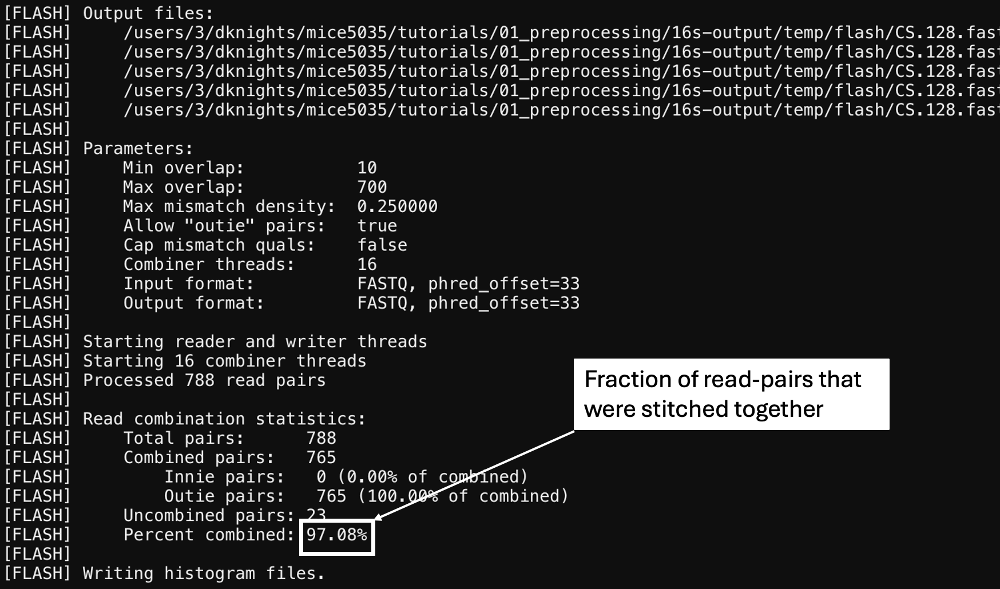
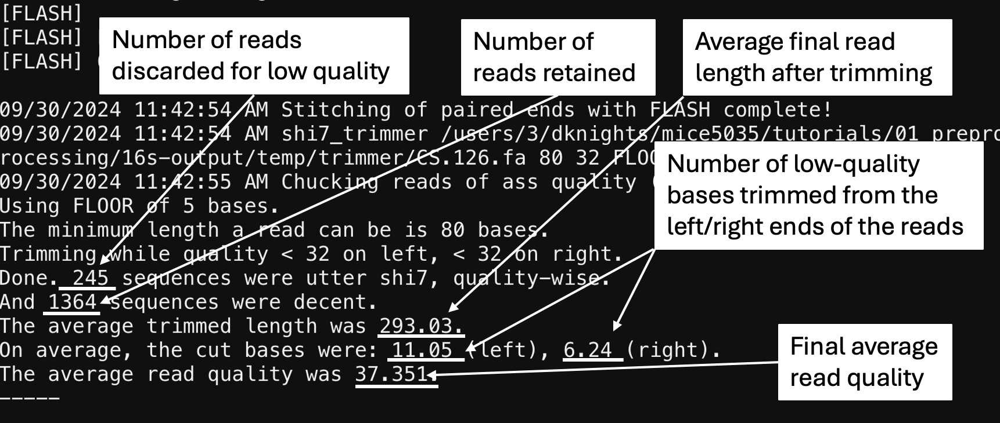

## MiCE 5035 Tutorial: Preprocessing

### Background
In this tutorial we will learn how to use the command line to
use a preprocessing tool to perform quality trimming and filtering on 16S and shotgun data.

### Connect to an interactive computing node at MSI
- If you are not already logged in to an interactive computing node at MSI, Follow the steps in the [getting started guide](../../README.md) to get connected to an interactive node on MSI.


### Navigate to the correct directory
```bash
# print the current working directory
pwd

# change to your home directory if you are not already there.
# Entering "cd" on its own will always take you home
cd 

# change into course repository directory that you cloned from git (above).
# the change to this tutorial directory
cd mice5035
cd tutorials
cd 01_preprocessing
```

## Visualize sequence quality. 
### Run the fastqc program to visualize sequence quality
```bash
module load fastqc
mkdir 16s-fastqc
fastqc -o 16s-fastqc /home/knightsd/public/imp/16s-shallow/*.fastq.gz
```

### Transfer files back to your computer and view in a web browser
- Use the OnDemand Dashboard to select and download the entire `16s-fastqc` folder to your computer Desktop or class folder. Open the folder to unzip/decompress it, and open the first `html` file.
- When does the sequence quality begin to drop off? If you had to choose a single length at which to truncate the sequences (trim off the ends, what would it be)? A quality score of 30 or 35 or higher is usually considered good.
- Scroll down to view the table of overrepresented sequences. Copy and paste the first one in to [NCBI's BLAST tool](https://blast.ncbi.nlm.nih.gov/Blast.cgi). Does it look suspicious?

## Run quality filtering with SHI7
### run shi7 on Immigration Microbiome Project (IMP) 16S data
Note: we are running the ["portable" version of SHI7](https://github.com/knights-lab/shi7/releases/tag/v1.0.1). You could download this to your own directory, add it to your `PATH` as we did in the "Getting Started Guide," and run your own version. I am letting you just run mine here to save time and energy for more important things.

A subsampled shallow set of the IMP 16s data are located here: `/home/knightsd/public/imp/16s-shallow/`. 

Before running the quality filtering, first use the `-h` flag (short for "help") to print out the instructions for `shi7.py`/. You will see that there are many different settings that can be specified using certain command-line "flags". For example, if you do not want to convert the output data to FASTA format (from FASTQ format), you can run shi7 with the flag `--convert_fasta False`.

Note that you need to load an older version of python for Shi7 to work (3.6.3).
```bash
module load python/3.6.3
python3 /home/knightsd/public/shi7/shi7.py -h
```

```bash
python3 /home/knightsd/public/shi7/shi7.py -i /home/knightsd/public/imp/16s-shallow/ -o 16s-output

# print top 10 lines of output FASTA (.fna) file 
# inspect combined_seqs file (cut -c 1-100 cuts out the first 100 characters of each line)
head 16s-output/combined_seqs.fna | cut -c 1-100

```
#### Troublshooting "flash" error
Note: if you got an error saying that "flash" could not be found, please make sure you did the steps in the [One-time setup intructions](../../one_time_setup.md), and then run this: `source ~/.bash_profile`. This is telling the operating system to load in your configuration file. Then run the above `shi7.py` command again.

### Examine the log file to learn about your data
We will use the program `less` to scroll through the log file. Make sure you quit `less` by typing "q" when you are done viewing the file.
```bash
# less lets you scroll up and down in a file without editing
# exit from less by typing “q”
less 16s-output/shi7.log

# use the log file to answer these questions:
# What fraction of reads was stitched in each sample?
# How many bases were trimmed from the left and right of each read?

# exit from less by typing “q”
q
```
The log file shows how well stitching of read pairs went, if it was performed, and it shows the results of the quality trimming and filtering. These images explain how to interpret the log file.

Stitching results (closer to the top of the file):



Trimming and quality filtering results (closer to the bottom of the file):



### Run shi7 on IMP WGS data
These are whole-genome shotgun (WGS) sequencing data. Only 3 samples from 3 groups are included due to the large size of the files, and they have been subsampled to only 100,000 sequences per sample, down from 20-30 million.
```bash
# run shi7 on the paired-end wgs data, keep separate fasta files in the output
python3 /home/knightsd/public/shi7/shi7.py -i /home/knightsd/public/imp/wgs-shallow -o wgs-output --combine_fasta False

# list contents of output folder
ls wgs-output
```

Examine the output files and the log file as before:
```bash
# print top 10 lines of the first output fastq (.fq) file 
head wgs-output/CS.079.S37.001.fna

# examine the log file as above
# less lets you scroll up and down in a file without editing
less wgs-output/shi7.log

# exit from less by typing “q”
q
```

For practice, run QC on the same paired-end wgs data, but this time disable stitching. Also keep separate output files, and don't convert to FASTQ format. This means there will be two output file per sample, in FASTQ format. Be sure to use a different output folder as shown here.

Note: _Flash_ is the program that we use for stitching reads. So to disable read stitching, we include the flag `--flash False`.
```bash
# keep separate fastq files
time python3 /home/knightsd/public/shi7/shi7.py -i /home/knightsd/public/imp/wgs-shallow -o wgs-output-no-stitch --combine_fasta False --convert_fasta False --flash False

# use the log file to answer these questions:
# How long were the average reads in each sample?
# How many bases were trimmed from the left and right of each read?
```

### Additional exercises

Read the SHI7 help output (shi7.py -h) for instructions. Then rerun it with different settings to try to achieve these results. Then answer the questions about the output.

1. Run on paired-end wgs data, no stitching, produce separate fasta (not fastq) files.
- Print out the first sequence of the first R1 fasta file. How long is it?

2. Run on paired-end wgs data and do not trim by quality
- How long were the average reads in each sample?
- How many bases were trimmed from the left and right of each read?

3. Run on paired-end data and decrease the minimum quality score for trimming
- How long were the average reads in each sample?
- How many bases were trimmed from the left and right of each read

### Appendix
Note: when sequence data come off the Illumina sequencer they have a bunch of extra text in the filenames. Instead of `Sample1_R1.fastq`, samples are named `Sample1_Sxxx_R1_001.fastq` where `Sxxx` might have 1, 2, or 3 digits after the `S`. This text is annoying because it makes your sample IDs not match with your metadata file, so you have to get rid of it somehow. One way is to just rename the files, using a command like this:
```bash
for f in *.fastq.gz; do echo $f; mv $f "$(echo "${f}" | sed 's/_S[0-9][0-9]*_R\([1-2]\)_001/_R\1/')"; done
```
In MICE 5035, you are not expected to learn how to write advanced commands like this for yourself; the command is only provided here for future reference.

### Next: Tutorial 2
When you are finished, move on to [Tutorial 02, 16s Feature Extraction](../02_16s_feature_extraction)
