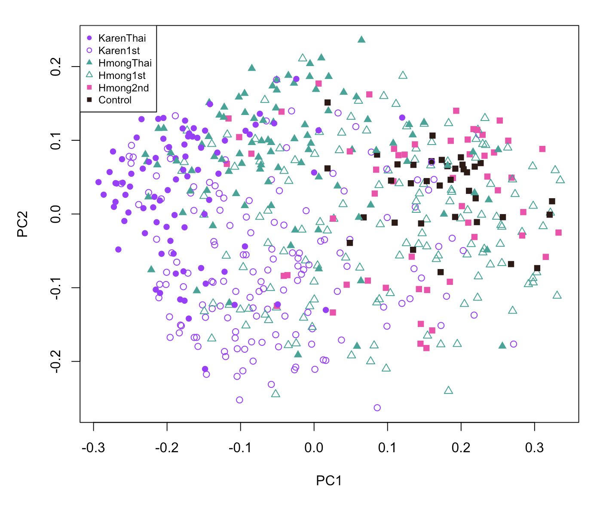

## MiCE 5035 Tutorial 6: Statistical analysis of beta diversity in R

### Background
This tutorial is an introduction to statistical testing of beta diversity in microbiome data in _R_. It will include making some visualizations to accompany the statistical tests. 

### Requirements
You must have completed [Tutorial 5](../05_visualization_in_R).

### Create a separate script for loading data
Make sure you (still) have open your Tutorials project.

The first step will be to create a separate script that will load in the data tables and get them ready for analysis. Then we can call that script from any other scripts without having to copy all of the commands each time.

Create a new R source file and call it, `load_data.r`. Add all these commands (similar to those in tutorial 5) that load the data and get some of the categorical variables ready to use. Paste the following commands into `load_data.r` and then save the file. Note: you will need to change the `XXX` to your unique project identifier in the URL for each of the four data tables.
```bash
# load clean preprocessed data tables
# Replace XXX with your project ID
map <- read.delim(url("https://github.com/danknights/mice5035_data/raw/main/data_tables/XXX/map.txt"),row=1, as.is=FALSE)
alpha <- read.delim(url("https://github.com/danknights/mice5035_data/raw/main/data_tables/XXX/alpha.txt"),row=1)
beta_uuf <- read.delim(url("https://github.com/danknights/mice5035_data/raw/main/data_tables/XXX/beta_uuf.txt"),row=1)
genus <- read.delim(url("https://github.com/danknights/mice5035_data/raw/main/data_tables/XXX/genus.txt"),row=1)

# Let's tell R to show sample groups in a certain order. 
# This is to ensure that when we make plots, R puts
# the groups in an order that makes sense visually.
# We will do the same thing for Generation and BMI.Class.
map$Sample.Group <- factor(map$Sample.Group,levels=c('KarenThai','Karen1st','HmongThai','Hmong1st','Hmong2nd','Control'))
map$Generation <- factor(map$Generation,levels=c('Thai','1stGen','2ndGen','Control'))
map$BMI.Class <- factor(map$BMI.Class,levels=c('Normal','Overweight','Obese'))
```


### Load the data
Create a new R source file and call it, `tutorial_06.r`. Load in the `vegan` package that we used in tutorial 5, and use `source` to tell _R_ to run the commands that you stored in `load_data.r`.
```bash
library('vegan')

# load all of the preprocessed data
source('load_data.r')
```

### Make a Beta diversity plot and test for significance
We will start with the final beta diversity plot (minus the ellipses) from tutorial 5. Paste these commands into your source file and run them.
```bash
# These colors correspond to the order of sample groups in map$Sample.Group:
# KarenThai, Karen1st, HmongThai, Hmong1st, Hmong2nd, Control
GROUP.COLORS <- c("#A300FF",  "#A300FF", "#00A696","#00A696", "#FE42AD", "#2E1915") # purple, teal, pink, black

# Run principal coordinates analysis (PCoA) on the unweighted UniFrac distances
pc <- cmdscale(beta_uuf)

# Plot the first two dimensions of PCoA
# The pch symbols are solid circle, empty circle,
# solid triangle, empty triangle, solid square, solid square,
# corresponding to KarenThai, Karen1st, HmongThai, Hmong1st, Hmong2nd, Control
plot(pc[,1],pc[,2],pch=c(16,1,17,2,15,15)[map$Sample.Group],col=GROUP.COLORS[map$Sample.Group], xlab='PC1', ylab='PC2')

# Add ellipses for the sample groups
dataEllipse(x=pc[,1], y=pc[,2], groups=map$Sample.Group,plot.points=FALSE,levels=0.68,robust=TRUE,col=GROUP.COLORS,segments=100)

# add a legend with the appropriate symbols and colors
legend('topleft', levels(map$Sample.Group), pch=c(16,1,17,2,15,15), col=GROUP.COLORS, cex=.75)
```

You should now have a plot that looks approximately like this, but with fewer samples and with ellipses:



## Exercise 1
- A. Change three things about your plot by modifying arguments in the calls to `plot`, `dataEllipse`, and/or `legend`. Describe how and why you made the changes, and what effect they had. Copy the command you ran and a screen capture of the figure to your worksheet.

Now we will test for significant clustering of samples according to sample group, using the `adonis` function in the `vegan` package. The `adonis` function is specifically designed to test for association of beta diversity distances with study variables like sample groups. It is similar to the _PERMANOVA_ test, which is also popular in the ecology field. The study variables can be continuous or categorical. Copy this code into your `tutorial_06.r` file, save it, and then run the command.
```bash
# Run the adonis2 permutation test to test whether
# differences in beta diversity are related to sample group membership.
adonis2(beta_uuf ~ Sample.Group, data=map)
```

The output should look approximately like this:


`adonis2` tests whether differences in beta diversity are related to sample group membership. In other words, we are asking, "do people in the same sample group have more similar microbiomes to each other than to people in a different sample group?" In the command above we have given the `adonis2` function what in _R_ is called a _formula_. The formula is of the form `y ~ x`, where `y` is our beta diversity matrix and `x` is our list of sample group labels. Another way to describe this would be to say that we are asking the `adonis2` function whether the beta diversity value between two subjects depends on whether they are in the same sample group.

---

## Exercise 2
- A. Examine the output from `adonis2`. Find the p-value in the output. What is the p-value? Did the test show a statistically significant association between Sample.Group and beta diversity?
- B. `adonis2` took a few seconds to run. This is because it is a permutation-based test. It randomly permutes the sample IDs many times, and uses those permutations to generate a null distribution for the difference between groups. Then it compares the actual difference between groups to the null distibution from the permutations to get a p-value. Read the documentation for the `adonis2` function by running `?adonis2` in the console. How many permutations does it perform by default?
- C. Try running it again with 9999 permutations. Copy the command you ran and a screen capture of the output to your worksheet.
- D. What is the new _p-value_? Did it get larger or smaller? Why?

---

### Add a covariate to the test
We tested only whether beta diversity is associated with Sample Group. There could be other variables that explain the variation in beta diversity. One such variable could be body mass index class (BMI.Class; Lean/Overweight/Obese). We can ask `adonis2` to test two variables at the same type, by providing a formula like this: `y ~ x1 + x2`. Let's add BMI as an additional variable. We will run the command twice, with the independent variables in different order each time. Copy this into your source file and then run it.
```bash
# Test if variation in beta diversity is associated with 
# sample group or subject BMI Class
# with Sample.Group first
adonis2(beta_uuf ~ Sample.Group + BMI.Class, data=map)

# Run again with BMI.Class first
adonis2(beta_uuf ~ BMI.Class + Sample.Group, data=map)
```

In the first set of results, the p-value for _Sample.Group_ is telling us the significance of the association between beta diversity and Sample.Group alone, ignoring BMI status. The second line in the first set of results is telling us the significance of the association between beta diversity and BMI status _while controlling for the influence of Sample.Group._ Similarly, in the second set of results, the second line is telling us the significance of the association of beta diversity and _Sample.Group_  while controlling for the influence of _BMI.Class_. Hence, we are most interested in the second row of each of these tables.

There is an excellent explanation of how to interpret the various outputs of an ANOVA test in _R_ [here](https://www.r-bloggers.com/2011/03/anova-%E2%80%93-type-iiiiii-ss-explained/), attributed to Falk Scholer.

---

## Exercise 3
- A. Copy the commands you ran and a screen capture of the output of both `adonis2` commands to your worksheet.
- B. What are the relevant p-values for the significance of beta diversity vs. BMI.Class while controlling for the influence of Sample.Group, and for beta diversity vs Sample.Group while controlling for the influence of BMI.Class? Which is more highly significant, Sample.Group or BMI.Class?
- C. Rerun the `adonis2` test using only the `Generation` variable alone. Is this also significant? What is the p-value?

---


### Perform a test in a subset
So far we have only tested for associations across the entire data set. Often, we will desire to test for associations in only a subset. For example, we can see in the plot that 2ndGen subjects seem to cluster mostly with the US Controls. We can test whether this is significant, but we need to select only the relevant samples. For this, we will find the indices that we want and store them in a variable `ix` (we could call the variable anything). We will then use that variable to select the desired samples from the tables. Copy this to your source file and then run it.
```bash
# ix will contain TRUE if Sample.Group is 2ndGen or Control.
# The "|" symbol means OR.
ix <- map$Generation == "2ndGen" | map$Generation == "Control"
```

Let us now examine how many subjects are in each group in the `Generation` variable. We can use the `table` command to show us the size of each group in a categorical variable. Run these in the console (no need to save them in your source file).
```bash
# How many subjects belonging to each generation?
table(map$Generation)

# How many in each generation after we select only 2ndGen and Control?
# We are using the ix variable from above.
table(map$Generation[ix])
```

This should show that there are 54 subjects in the 2ndGen group and 36 subjects in the Control group. Now let us run the `adonis2` test, only in these two groups. Note that we had to use `ix` in both the rows and columns of `beta_uuf`. Check your understanding: can you explain why? Copy this into your source file and then run it.
```bash
# Run adonis2 test on Generation group, only in 2ndGen and Controls
adonis2(beta_uuf[ix,ix] ~ Generation, data=map[ix,])
```  

The output shows that beta diversity variation is highly associated with Generation even between the 2ndGen and Control groups. Take note of this as it will be referenced in tutorial 7.

### Testing beta diversity vs. a continuous variable
Based on the beta diversity plot above, at appears that Thailand residents are on one side, US Controls and 2ndGen subjects are on the other, and the 1stGen subjects are in between. Is this because the newly arrived 1stGen immigrants and refugees are closer to their Thailand counterparts, and the the long-term USA-resident 1stGen are closer to the US controls? We could use `adonis2` to test this, but what we really want to know is whether length of residence in US is associated with the _PC1_ in the ordination. We can test this with `cor.test`.

First, get the indices of all of the 1stGen samples as follows. Copy this into your source file and then run it.
```bash
# Get the indices where there is a known (not NA) duration of US residence
ix <- map$Generation == 1stGen
```

Now run the correlation test. We will test whether _PC1_, the first column of the `pc` matrix, is significantly correlated with _Years.in.US_. Copy this into your source file and then run it.
```bash
# test whether PC1 is correlated with Years.in.US
cor.test(pc[ix,1], map$Years.in.US[ix])
```

---

## Exercise 4
- A. Copy the `cor.test` command you ran and a screen capture of the output to your worksheet.
- B. What is the p-value? What is the correlation value?
- C. Does the direction of the correlation (positive or negative) make sense, based on the location of the Thai and US Control samples on your beta diversity plot? Why/why not?

---

We may also want a visualization to accompany our statistical test. We could simply do a scatterplot, as follows. Copy this into your source file and then run it.
```bash
# scatterplot of Years.in.US vs PC1
plot(pc[ix,1], map$Years.in.US[ix], xlab='PC1 of unweighted UniFrac distance', ylab='Years in US')
```

We could even add a best-fit line. `lm` fits a linear model, and `abline` draws it. Copy this into your source file and then run it.
```bash
# add best fit line to plot
abline(lm(map$Years.in.US[ix] ~ pc[ix,1]))
```

By the way, if you want to automatically save a figure to a PDF, you can do so like this:
```bash
# Save as PDF; width and height are in inches
pdf('years_in_us_v_pc1.pdf', width=5, height=5)
plot(pc[ix,1], map$Years.in.US[ix], xlab='PC1 of unweighted UniFrac distance', ylab='Years in US')
abline(lm(map$Years.in.US[ix] ~ pc[ix,1]))
dev.off()
```

### Conclusion
These examples cover the most common types of statistical tests during beta diversity analysis. Some additional exercises to explore on your own include coloring the points according to a continuous variable, repeating these analysis with different diversity metrics, or doing [procrustes analysis](https://john-quensen.com/tutorials/procrustes-analysis/) to compare two different beta diversity matrices.
  
Continue to [Tutorial 7](../07_univariate_stats)

