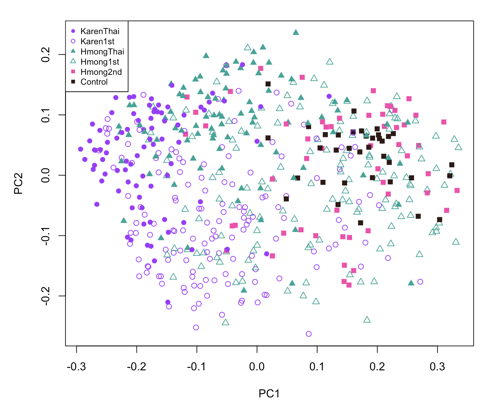
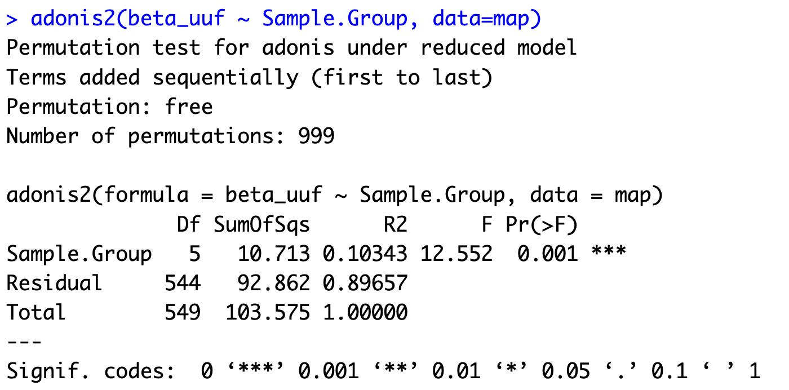

## MiCE 5035 Tutorial: Statistical testing in R

### Background
This tutorial is an introduction to statistical analysis of microbiome data in _R_. It will include making some visualizations to accompany the statistical tests.

### Requirements
You must have completed [Tutorial 5](../05_visualization_in_R).


#### Install some needed packages
Make sure you (still) have open your Tutorials project.

The first step will be to create a separate script that will load in the data tables and get them ready for analysis. Then we can call that script from any other scripts without having to copy all of the commands each time.

Create a new R source file and call it, `load_data.r`. Add all of the commands from tutorial 5 that load the data and get some of the categorical variables ready to use. Paste the following commands into `load_data.r` and then save the file.
```bash
# load all of the clean, preprocessed data tables
map <- read.delim("map.txt",row=1, as.is=FALSE)
otus <- read.delim("otu_table.txt", row=1)
alpha <- read.delim("alpha.txt",row=1)
beta_uuf <- read.delim("beta_uuf.txt",row=1)
beta_wuf <- read.delim("beta_wuf.txt",row=1)
phylum <- read.delim("phylum.txt",row=1)
genus <- read.delim("genus.txt",row=1)

# Let's tell R to show sample groups in a certain order. 
# This is to ensure that when we make plots, R puts
# the groups in an order that makes sense visually.
# We will do the same thing for Generation and BMI.Class.
map$Sample.Group <- factor(map$Sample.Group,levels=c('KarenThai','Karen1st','HmongThai','Hmong1st','Hmong2nd','Control'))
map$Generation <- factor(map$Generation,levels=c('Thai','1stGen','2ndGen','Control'))
map$BMI.Class <- factor(map$BMI.Class,levels=c('Normal','Overweight','Obese'))
```

### Tutorial

#### Load the data
Create a new R source file and call it, `tutorial_06.r`. Load in the `vegan` package that we used in tutorial 5, and use `source` to tell _R_ to run the commands that you stored in `load_data.r`.
```bash
library('vegan')

# load all of the preprocessed data
source('load_data.r')
```

#### Make a Beta diversity plot and test for significance
We will start with the final plot from tutorial 5. Paste these into your file and execute them.
```bash
# These colors correspond to the order of sample groups in map$Sample.Group:
# KarenThai, Karen1st, HmongThai, Hmong1st, Hmong2nd, Control
GROUP.COLORS <- c("#A300FF",  "#A300FF", "#00A696","#00A696", "#FE42AD", "#2E1915") # purple, teal, pink, black

# Run principal coordinates analysis (PCoA) on the unweighted UniFrac distances
pc <- cmdscale(beta_uuf)

# Plot the first two dimensions of PCoA
# The pch symbols are solid circle, empty circle,
# solid triangle, empty triangle, solid square, solid square,
# corresponding to KarenThai, Karen1st, HmongThai, Hmong1st, Hmong2nd, Control
plot(pc[,1],pc[,2],pch=c(16,1,17,2,15,15)[map$Sample.Group],col=GROUP.COLS[map$Sample.Group], xlab='PC1', ylab='PC2')

# add a legend with the appropriate symbols and colors
legend('topleft', levels(map$Sample.Group), pch=c(16,1,17,2,15,15), col=GROUP.COLS, cex=.75)
```

You should now have a plot that looks approximately like this:




Now we will test for significant clustering of samples according to sample group, using the `adonis` function in the `vegan` package. The `adonis` function is specifically designed to test for association of beta diversity distances with study variables like sample groups. It is similar to the _PERMANOVA_ test, which is also popular in the ecology field. The study variables can be continuous or categorical. Copy this code into your `tutorial_06.r` file, save it, and then run the command.
```bash
# Run the adonis2 permutation test to test whether
# differences in beta diversity are related to sample group membership.
adonis2(beta_uuf ~ Sample.Group, data=map)
```

The output should look like this:



`adonis2` tests whether differences in beta diversity are related to sample group membership. In other words, we are asking, "do people in the same sample group have more similar microbiomes to each other than to people in a different sample group?" In the command above we have given the `adonis2` function what in _R_ is called a _formula_. The formula is of the form `y ~ x`, where `y` is our beta diversity matrix and `x` is our list of sample group labels. Another way to describe this would be to say that we are asking the `adonis2` function whether beta diversity varies as a function of group membership.

#### Exercises
- Examine the output from `adonis2`. Did the test show a statistically significant association between Sample.Group and beta diversity? Where can you find that information in the output? What is the _p-value_?
- Note: previously when we wanted to access the sample group labels from the `map` table, we had to use `map$Sample.Group` or `map[,'Sample.Group']`. But in this command, we simply said, `Sample.Group`. Why did this work? It has something to do with the `data=map` argument. Try reading the documentation by running this command _in the console_: `?adonis2`. Find the description of the arguments, and read what the `data` argument is for. 
- `adonis2` took a few seconds to run. Why? It is a permutation-based test. It randomly permutes the sample IDs many times, and uses those permutations to generate a null distribution for the difference between groups. Then it compares the actual difference between groups to the null distibution from the permutations to get a p-value. Read the documentation again. How many permutations does it perform by default? Try running it again with 9999 permutations. What is the new _p-value_? Did it get larger or smaller? Why?


### Add a covariate to the test
We tested only whether beta diversity is associated with Sample Group. There could be other variables that explain the variation in beta diversity. One such variable could be body mass index (BMI). We can ask `adonis2` to test two variables at the same type, by providing a formula like this: `y ~ x1 + x2`. Let's add BMI as an additional variable:
```bash
# Test if variation in beta diversity is associated with 
# sample group or subject BMI
adonis2(beta_uuf ~ Sample.Group + BMI, data=map)
```

#### Exercises
- What was the result? Which is more highly significant, Sample.Group or BMI? 
- Rerun the `adonis2` test using only the `Generation` variable (Thai, 1st, 2nd, or Control). Is this also significant? What is the p-value?


### Perform a test in a subset
So far we have only tested for associations across the entire data set. Often, we will desire to test for associations in only a subset. For example, we can see in the plot that 2ndGen subjects seem to cluster mostly with the US Controls. We can test whether this is significant, but we need to select only the relevant samples. For this, we will find the indices that we want and store them in a variable `ix` (we could call the variable anything). We will then use that variable to select the desired samples from the tables. Copy this to your source file and then run it.
```bash
# ix will contain TRUE if Sample.Group is 2ndGen or Control.
# The "|" symbol means OR.
ix <- map$Generation == "2ndGen" | map$Generation == "Control"
```

Let us now examine how many subjects are in each group in the `Generation` variable. We can use the `table` command to show us the size of each group in a categorical variable. Run these in the console:
```bash
# How many subjects belonging to each generation?
table(map$Generation)

# How many in each generation after we select only 2ndGen and Control?
# We are using the ix variable from above.
table(map$Generation[ix])
```

This should show that there are 54 subjects in the 2ndGen group and 36 subjects in the Control group. Now let us run the `adonis2` test, only in these two groups. Note that we had to use `ix` in both the rows and columns of `beta_uuf`. Check your understanding: can you explain why? 
```bash
adonis2(beta_uuf[ix,ix] ~ Generation, data=map[ix,])
```  

The output shows that beta diversity variation is highly associated with Generation even between the 2ndGen and Control groups.

#### Exercise
- Although the test result was significant, there may be another explanation. A common concern with beta diversity testing is that differences in the _dispersion_ of the groups (how spread out each group is) can cause the `adonis2` results to appear significant. Examine the beta diversity plot above. Which group has higher dispersion, 2ndGen (labeled Hmong2nd) or Control?
- Read the documentation for `adonis2` again, and scroll down to the "Note" near the bottom. What function do the authors suggest to test for differences in dispersion of beta diversity across groups? 


We will now run the `betadisper` test to test whether differences in dispersion may be confounding our test for significant differences in beta diversity between 2ndGen and US Controls. Copy this into your source file and run it:
```bash
# run a permutation test on the output of the beta dispersion analysis
# this was taken from the example in the documentation of betadisper
permutest(betadisper(as.dist(beta_uuf[ix,ix]), map$Generation[ix]))
```

Here we see that there is a significant difference in dispersion (spread) of beta diversity between the two groups. Does this mean that our `adonis2` test was not actually trustworthy?

#### Exercise 
- Read the answer to [this question on StackExchange](https://stats.stackexchange.com/questions/314184/betadisper-is-significant-can-i-still-do-adonis-and-anosim) and decide whether you think dispersion may be an issue here, based on the size of the 2ndGen group and the size of the Control group.
- (Optional) We can see that there are about 50% more samples in the 2ndGen group than in the Control group. The StackExchange page (describing a peer-reviewed publication on this topic) said that `adonis2` is not overly sensitive to dispersion when the groups are balanced. One clever approach we can use now is to pick a random subset of the 2ndGen samples so that the two groups will be the same size, and then repeat the `adonis2` test. Use `which` to convert the TRUE/FALSE indices to row numbers, and use `sample` to subsample 36 of the 2ndGen sample rows, and store them in `ix` like this: `ix <- c(sample(which(map$Generation == "2ndGen"),36), which(map$Generation == "Control"))`. Then rerun `adonis2` to determine whether it is still significant when the two groups are exactly the same size.


### Test a continuous variable in a different subset
Based on the beta diversity plot above, at appears that Thailand residents are on one side, US Controls and 2ndGen subjects are on the other, and the 1stGen subjects are in between. Is this because the newly arrived 1stGen immigrants and refugees are closer to their Thailand counterparts, and the the long-term USA-resident 1stGen are closer to the US controls? We could use `adonis2` to test this, but what we really want to know is whether length of residence in US is associated with the _PC1_ in the ordination. We can test this with `cor.test`.

First, get the indices of all of the samples that don't have `NA` listed for Years.in.US. Note: the `!` before `is.na` means "not". So this will return TRUE for any row where Years.in.US is _not_ `NA`. Copy this into your source file and then run it.
```bash
ix <- !is.na(map$Years.in.US)
```

Now run the correlation test. We will test whether _PC1_, the first column of the `pc` matrix, is significantly correlated with _Years.in.US_. Copy this into your source file and then run it.
```bash
cor.test(pc[ix,1], map$Years.in.US[ix])
```

What is the p-value? What is the correlation? Does the direction of the correlation (positive or negative) make sense, based on the location of the Thai and US Control samples on your beta diversity plot? 


### Conclusion
These examples cover the most common types of statistical tests during beta diversity analysis. Some additional exercises to explore on your own include coloring the points according to a continuous variable, repeating these analysis with different diversity metrics, or doing [procrustes analysis](https://john-quensen.com/tutorials/procrustes-analysis/) to compare two different beta diversity matrices.
  
