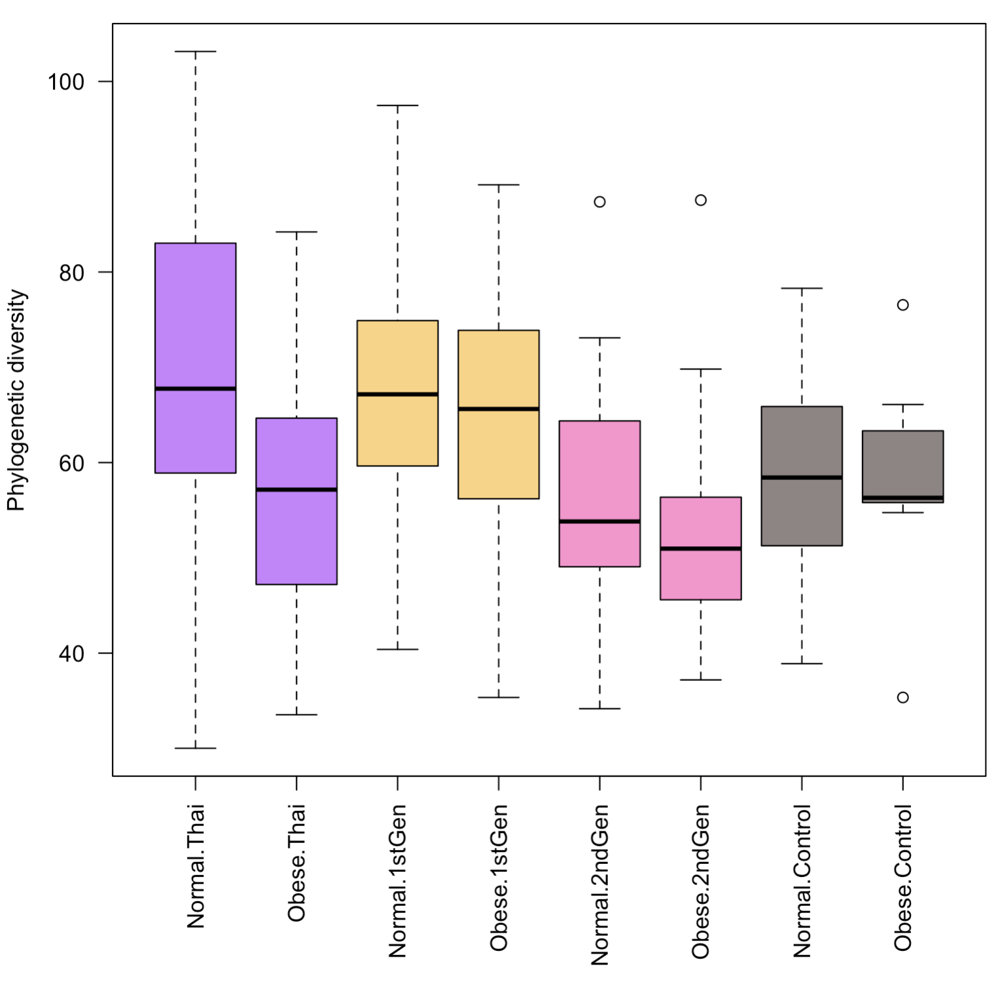

# MiCE 5035 Tutorial 7: Univariate statistical testing in R

### Background
This tutorial is an introduction to univariate statistical analysis of microbiome data in _R_. Univariate features include alpha diversity and OTU/taxon abundances.

### Requirements
You must have completed [Tutorial 6](../06_beta_diversity_stats).

Make sure you (still) have open your Tutorials project.

### Load the data
Create a new R source file and call it, `tutorial_07.r`. Use `source` to tell _R_ to run the commands that you stored in `load_data.r`.
```bash
# load all of the preprocessed data
source('load_data.r')
```

### Alpha diversity statistical testing
We will start with the final alpha diversity plot from tutorial 5, but we will subset the data to include only Lean and Obese categories. Subsetting was discussed in Tutorial 6.

An important note: when we subset a factor (categorial variable), R will keep around any empty categories (levels) unless you explicitly tell R to drop them using `droplevels`. I have spent countless hours over the years debugging code when it turns out that I simply didn't think to call `droplevels`. You can see here that we apply `droplevels` to the entire subsetted map table.

Copy these into your file and execute them.
```bash
# These colors represent Thai, 1stGen, 2ndGen, US
# The 2 copies will color the boxes for Lean, Obese
GROUP.COLORS.FADED <- c("#A300FF99", "#A300FF99", "#FBB40099", "#FBB40099", "#FE42AD99", "#FE42AD99", "#2E191599", "#2E191599")

# boxplot of diversity by Lean/Obese
# Note: we have to run "droplevels" on the subset map table.
# This causes it to ignore empty categories in factors
# (categorical variables). This way, the "Overweight" category
# doesn't show up in the plot
boxplot(alpha$PD_whole_tree ~ BMI.Class * Generation, data=droplevels(map),las=2, col=GROUP.COLORS.FADED, xlab='', ylab='Phylogenetic diversity')
```

You should have a plot that looks approximately like this:




We now wish to test whether alpha diversity (phylogenetic diversity) is significantly associated with Generation, BMI status, or their interaction. To make it easier to read, we will first store the values in new variables. Copy these into your file and execute them.
```bash
# get the subsetted diversity scores
div <- alpha$PD_whole_tree

# get the lean/obese vector, dropping the "Overweight" level
bmi <- map$BMI.Class

# get the Generation vector. We aren't actually dropping any 
# levels here (Thai, 1stGen, 2ndGen, Control all stick around), 
# so calling droplevels doesn't do anything, but its good 
# to be paranoid about always dropping empty factor levels
gen <- map$Generation
```

Now we will test for significant differences in alpha diversity across groups. To do this we will apply two ANOVA (analysis of variance) tests, one with BMI class listed first, one with generation listed first.
```bash
# run an ANOVA with gen listed first.
# In the output, we will care only about the p-values for "bmi"
# and the interaction term bmi:gen
anova(lm(div ~ gen * bmi))

# run an ANOVA with bmi listed first.
# Here we will care only about the p-value for "gen"
# (and the interaction term, but it will be the same as above)
anova(lm(div ~ bmi * gen))
```

The output should look approximately like this:


---

## Exercise 1
- A. Take a screenshot of your test results for the two ANOVA tests above and add it to your worksheet.
- B. What are the relevant p-values for the significance of diversity vs. Obesity while controlling for the influence of Generation, and for diversity vs Generation while controlling for the influence of Obesity? Recall that we discussed how to interpret ANOVA-style results in the `adonis2` testing section in [tutorial 6](../06_beta_diversity_stats).
- C. Write a one-sentence explanation of what this result means about alpha diversity, obesity, and U.S. immigration.
  
---

### Check for normal distributions

We got a little carried away and went straight to the statistical testing using ANOVA, without first checking whether the data were normally distributed. Although taxa (OTUs, species, etc.) are almost _never_ normally distributed, alpha diversity often is normally distributed. We can take a quick peak at the distribution of alpha diversity values across all subjects, with the `hist` command. Run this in the console. 
```bash
# Histogram of alpha diversity values
hist(alpha$PD_whole_tree)
```

They should look reasonably normal. If we want to formally test for normality, we can run a Shapiro-Wilk test using `shapiro.test`. If the p-value is > 0.05, we can assume the data are normal. Run this in the console:
```bash
# Run shapiro-wilk test for non-normality
shapiro.test(alpha$PD_whole_tree)
```

We can even check within the Generation groups, by using subsets, like this. Run this in the console.

```bash
# get indices of Thai residents only
ix <- map$Generation == "Thai"
# Histogram of alpha diversity only in Thai residents
hist(alpha$PD_whole_tree[ix])
```

Note: the distributions don't have to be _perfectly_ normal to use parametric tests with certain normality assumptions like ANOVA or a t-test, especially with large sample sizes. For common parametric tests that assume normality, the assumption not that the _original values_ are normally distributed, but that the _residuals_ are normally distributed. For example, when using an ANOVA test to get p-values for fitting a linear model `y ~ x`, the assumption is not that `x` or `y` is normally distributed, but that the residuals (distance above/below the best-fit line) are normally distributed. In a t-test, the assumption is that the _mean_ in each group is normally distributed (if you were to re-sample the population and take the mean many times, you would get a normal distribution of means), not that the actual values are normally distributed in each group. The [central limit theorem](https://en.wikipedia.org/wiki/Central_limit_theorem) in statistics shows that the mean of the values will be close to normally distributed as long as you have around 30 samples or more per group, even if the values themselves are not normally distributed. So the normality assumption is not as big a deal as people often think.

Note: there are other key assumptions in linear regression and t-test that have to with the _variance_ of the samples. In linear regression, we assume [homoskedasticity](https://en.wikipedia.org/wiki/Homoscedasticity_and_heteroscedasticity), usually meaning that the variance of the values of `y` does not depend on the value of `x`. In other words, if you make a scatter plot of `y` vs `x`, the residuals (vertical spread) is roughly constant as you move from left to right. Similarly, in a t-test, we assume the same variance in the two groups. These assumptions may also be broken for OTU or taxon distributions in microbiome data. Thus, people tend to favor non-parametric tests for testing significance of associations between OTU or taxon distributions and study variables. We will use a parametric test (t-test) now for alpha diversity analysis, but we will switch to non-parametric tests below for OTU/taxon analysis.

Speaking of a t-test, before we move on to analysis of taxa, let us consider a simpler case of testing in alpha diversity where there are just two sample groups. For example, we can consider alpha diversity only in the US controls and the 2nd generation immigrants. When we have only two groups, and no interaction between two variables, we can perform a simple t-test using the function `t.test`. First, we will get the indices of the subset we want. Copy these into your source code and run them. 
```bash
# get indices of 2ndGen and US Controls only
ix <- map$Generation == "2ndGen" | map$Generation == "Control"

# run t.test on alpha diversity
t.test(alpha$PD_whole_tree[ix] ~ map$Generation[ix])
```

---

## Exercise 2
- A. What was the p-value of the test? Was the result significant? If so, was it highly significant or just barely significant?
- B. How does the result compare to the result from testing beta diversity between these two groups (2ndGen and Controls) in tutorial 6?
- C. Why is this interesting from a study perspective?

---

### Taxon differential abundance across 3+ groups

We can follow a similar approach to the statistical testing of taxa (e.g. OTUs, species, phyla) to what we did with alpha diversity. However, as noted above, they are rarely normally distributed, so we need to use a different type of test (not ANOVA) that is generally less powerful statistically. We can check to see if taxa are normally distributed, but we should not get our hopes up.

---

## Exercise 3
- A. Recall in tutorial 5 that we made a boxplot of the genus _Parabacteroides_ across generation groups. Check for normality of this genus visually using `hist`. Copy your code and screen capture of your histogram into your worksheet.

---

Clearly this taxon is not normally distributed, which violates the assumptions of the t-test (2 groups) and the ANOVA test (for 3+ groups). Fortunately we have two alternative so-called _non-parametric_ tests that we can use: Mann-Whitney U test (for 2 groups; also known as the Wilcoxon signed-rank sum test, although that is slightly different), and the Kruskal-Wallis test (for 3+ groups). 

Let's start by generating the boxplot from tutorial 5 again of _Parabacteroides_. Copy this to your source file and run it:
```bash
# boxplot of genus Parabacteroides split by Generation
boxplot(genus[,'g__Parabacteroides'] ~ map$Generation)
```

The boxplot should look like this:


To test for statistical association of this genus with Generation group, we will need to use the Kruskal-Wallis test (`kruskal.test`), because there are more than 2 groups, and the KW test is a nonparametric test for differences across 3 or more groups. We will run it as follows.

---

## Exercise 4
- A. Run the Kruskal-Wallis test using `kruskal.test`. You may want to view the instructions by entering `?kruskal.test` into your console. Copy the commands you ran and a screen capture of the output to your worksheet.
- B. Was the test significant? What was the p-value? What does this tell you about the genus _Parabacteroides_ and immigration to the U.S.A.?

---

### Taxon differential abundance across 2 groups

We will now practice testing with a non-parametric test for two groups, the Mann-Whitney U test or Wilcoxon signed-rank test. We will test whether the genus _Prevotella_ is differentially abundance between the 2ndGen and Control groups. First, we will get the indices of just these two groups, as we did in the alpha diversity section above, and we will make a boxplot. Note that we have to called `droplevels` on the Generation variable to make the `boxplot` function ignore the empty other groups.
```bash
# get indices of 2ndGen and US Controls only
ix <- map$Generation == "2ndGen" | map$Generation == "Control"

# Boxplot of prevotella vs Generation
# Note that we have to use droplevels to ignore the
# empty Thai and 1stGen groups
boxplot(genus[ix,'g__Prevotella'] ~ droplevels(map$Generation[ix]))
```

---

## Exercise 5
- A. Test whether _Prevotella_ is differentially abundant between 2ndGen and Control subjects. Find out how to run a Mann-Whitney U test in R (hint: it's not called a Mann-Whitney U test), and then test for differential abundance between these two study groups. Copy the commands you ran and a screen capture of the output to your worksheet.
- B. Why did we use a Mann-Whitney U test instead of a t-test?
- C. Why did we use a Mann-Whitney U test instead of a Kruskal-Wallis test?
- D. Was the test significant? What is the p-value?

---

### Correlations with continuous variables
So far we have discussed testing with categorical independent variables (generation, obesity status). We will also sometimes want to associate continuous independent variables with a continuous dependent variable through a correlation analysis. Here we have two primary options: if the data are presumed to be approximately normally distributed, we can use a Pearson's correlation test with the command `cor.test`. Otherwise, we will typically use a non-parametric correlation test called the Spearman correlation test. This also uses the function `cor.test`, but with the argument `method="spearman"`. 

What would be an interesting correlation to test in this data set? One continuous independent variable is Years of US residence ("Years.in.US").

---

## Exercise 6
- A. Test whether phylogenetic alpha diversity is significantly associated with years of U.S. residence. Follow the approach you used in tutorial 6 for testing for correlation of years of US residence with PC1 score, but with alpha diversity in place of PC1 score. Copy your answer to your source file and run it.

Important: in tutorial 6 we used the subset of 1stGen subjects for analyzing associations with Years of US residence. This is, in fact, the only group where it would make sense to test for associations with Years in US, because the Thai group has _never_ lived in the US, and the 2ndGen and Control groups have _always_ lived in the US. Therefore you will be selecting just the 1stGen samples for these tests, as in Tutorial 6:

```bash
# Get the indices where there is a known (not NA) duration of US residence
ix <- map$Generation == "1stGen"
```
Now run the correlation test.
- B. Actually, we hypothesized that diversity would go _down_ the longer a person lived in the US, so we should make this a one-tailed test. This means we ignoring the possibility that diversity could have gone up with duration of residence. This gives us more statistical power. Find out how to modify this command to run a one-tailed correlation test for the desired alternative. You can search the web, or you can run `?cor.test` in _R_ to read the documentation. What happened to the correlation statistic? What happened to the p-value, and why? If you need an additional reference, see the related [Wikipedia page](https://en.wikipedia.org/wiki/One-_and_two-tailed_tests).
- C. Using the same subset of subjects, test whether _Parabacteroides_ goes up the longer someone lives in the US. You will need to run `cor.test` with the additional `method=spearman` argmument as described above. Is it significant? What is the p-value? Does this fit your expectations after viewing the boxplot above?

---

## Optional Excersize 7
Multiple hypothesis testing with centered-log-ratio (CLR) transform:

# Apply CLR transform (to make the data more normal, and get rid of
# compositional artifacts)
# Note: if you don't have this library, install with install.packages('robCompositions')
library('robCompositions')
eps <- min(genus[genus > 0]) / 2 # set zero values to this tiny value
genus.nonzero <- genus
genus.nonzero[genus.nonzero == 0] <- eps
genus.nonzero <- sweep(genus.nonzero, 1, rowSums(genus.nonzero), '/')
genus.clr <- cenLR(genus.nonzero)$x.clr

# now see what's significant. We will use a t.test instead of wilcox test, 
# because we have done the CLR transform
pvals <- apply(genus.clr,2,function(xx) t.test(xx ~ droplevels(map$Vegetarian))$p.value)
qvals <- p.adjust(pvals,'fdr')

# print the 10 most significant taxa
sort(qvals)[1:10]

### Conclusion
We have covered the most common univariate statistical tests that one would perform in _R_. There are slightly more powerful tests available for differential abundance testing of taxa, such as the ANCOM package, but such packages have a steeper learning curve. We also did not cover alternative normalizations of relative abundances, such as the centered-log-ratio transform discussed in class. You are referred to the [`clr` function in the _compositions_ package](https://www.rdocumentation.org/packages/compositions/versions/2.0-6/topics/clr) for instructions on how to perform that transformation. 
  
