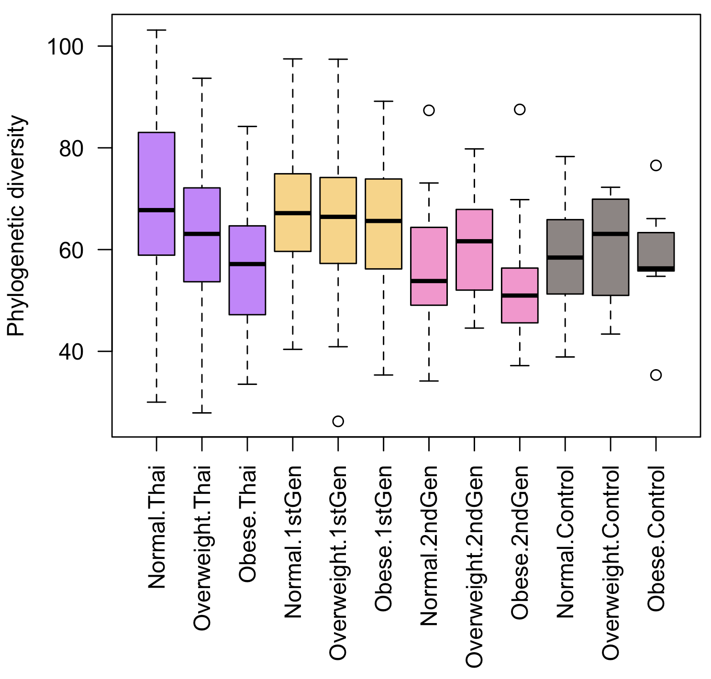
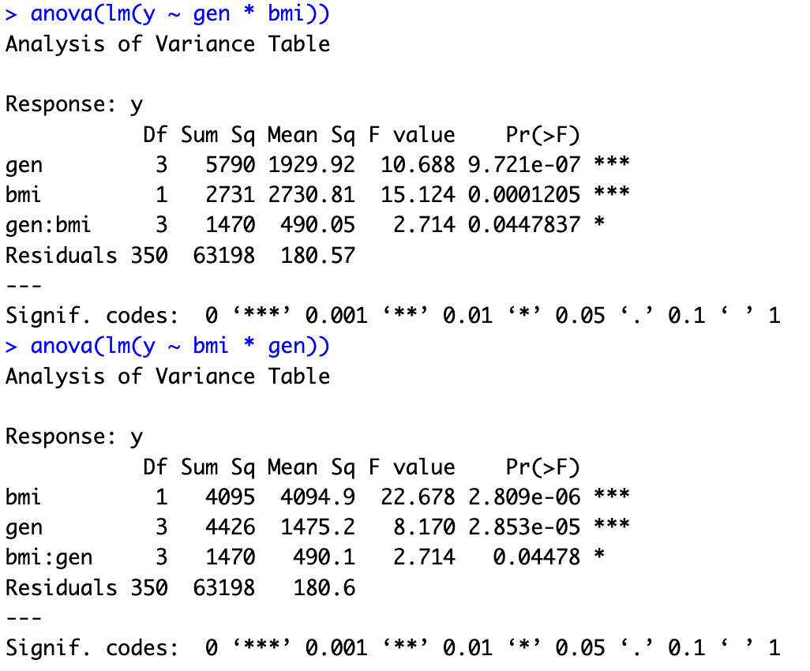
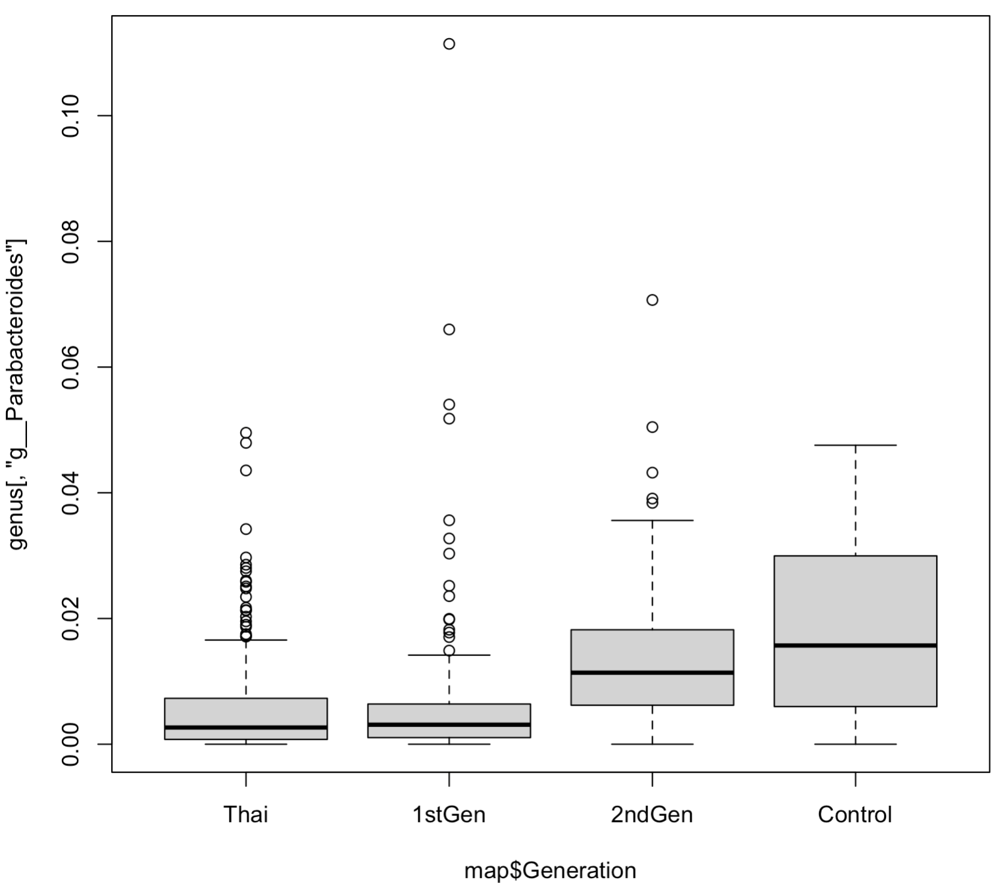

## MiCE 5035 Tutorial: Univariate statistical testing in R

### Background
This tutorial is an introduction to univariate statistical analysis of microbiome data in _R_. Univariate features include alpha diversity and OTU/taxon abundances.

### Requirements
You must have completed [Tutorial 6](../06_beta_diversity_stats).

### Create a separate script for loading data
Make sure you (still) have open your Tutorials project.

### Load the data
Create a new R source file and call it, `tutorial_07.r`. Use `source` to tell _R_ to run the commands that you stored in `load_data.r`.
```bash
# load all of the preprocessed data
source('load_data.r')
```

## Alpha diversity 
We will start with the final alpha diversity plot from tutorial 5, but we will subset the data to include only Lean and Obese categories. Subsetting was discussed in Tutorial 6.

An important note: when we subset a factor (categorial variable), R will keep around any empty categories (levels) unless you explicitly tell R to drop them using `droplevels`. I have spent countless hours over the years debugging code when it turns out that I simply didn't think to call `droplevels`. You can see here that we apply `droplevels` to the entire subsetted map table.

Copy these into your file and execute them.
```bash
# These colors represent Thai, 1stGen, 2ndGen, US
# The 2 copies will color tbe boxes for Lean, Obese
GROUP.COLORS.FADED <- c("#A300FF99", "#A300FF99", "#FBB40099", "#FBB40099", "#FE42AD99", "#FE42AD99", "#2E191599", "#2E191599")

# Select only Lean and Obese subjects (not overweight)
ix <- map$BMI.Class != "Overweight"

# boxplot of diversity by Lean/Obese
# Note: we have to run "droplevels" on the subset map table.
# This causes it to ignore empty categories in factors
# (categorical variables). This way, the "Overweight" category
# doesn't show up in the plot
boxplot(alpha$PD_whole_tree[ix] ~ BMI.Class * Generation, data=droplevels(map[ix,]),las=2, col=GROUP.COLORS.FADED, xlab='', ylab='Phylogenetic diversity')
```

You should have a plot that looks approximately like this:




We now wish to test whether alpha diversity (phylogenetic diversity) is significantly associated with Generation, BMI status, or their interaction. To make it easier to read, we will first store the values in new variables. Copy these into your file and execute them.
```bash
# get the subsetted diversity scores
diversity <- alpha$PD_whole_tree[ix]

# get the lean/obese vector, dropping the "Overweight" level
bmi <- droplevels(map$BMI.Class[ix])

# get the Generation vector. We aren't actually dropping any 
# levels here (Thai, 1stGen, 2ndGen, Control all stick around), 
# so calling droplevels doesn't do anything, but its good 
# to be paranoid about always dropping empty factor levels
gen <- droplevels(map$Generation[ix])
```

Now we will test for significant differences in alpha diversity across groups. To do this we will apply two ANOVA (analysis of variance) tests, one with BMI class listed first, one with generation listed first.
```bash
# run an ANOVA with gen listed first.
# In the output, we will care only about the p-values for "bmi"
# and the interaction term bmi:gen
anova(lm(y ~ gen * bmi))

# run an ANOVA with bmi listed first.
# Here we will care only about the p-value for "gen"
# (and the interaction term, but it will be the same as above)
anova(lm(y ~ bmi * gen))
```

The output should look like this:



In the first set of results (with `gen * bmi` in the formula), the p-value for _gen_ is telling us the significance of the association between diversity and Generation alone, ignoring BMI status. The second line is telling us the significance of the association between diversity and BMI status _while controlling for the influence of Generation._ Similarly, in the second set of results, the second line is telling us the significance of the diversity ~ Generation association while controlling for the influence of BMI status. Hence, we are most interested in the second row of each of these tables. The third row show the significance of the interaction term, essentially indicating the effect of BMI on diversity depends on the Generation, and vice versa, after controlling for the individual effects of BMI status and Generation.

Here we can see that the interaction term is just barely significant and is probably not of much interest. And we can see that the individual terms for BMI status and Generation are both highly significant. We could report these p-values in a publication. 

### Check for normal distributions

We got a little carried away and went straight to the statistical testing using ANOVA, without first checking whether the data were normally distributed. Although taxa (OTUs, species, etc.) are almost _never_ normally distributed, alpha diversity often is normally distributed. We can take a quick peak at the distribution of alpha diversity values across all subjects, with the `hist` command. Run this in the console. 
```bash
# Histogram of alpha diversity values
hist(alpha$PD_whole_tree)
```

Looks perfectly normal. If we want to formally test for normality, we can run a Shapiro-Wilk test using `shapiro.test`. If the p-value is > 0.05, we can assume the data are normal. Run this in the console:
```bash
shapiro.test(alpha$PD_whole_tree)
```

We can even check within the Generation groups, by using subsets, like this. Run this in the console.

```bash
# get indices of Thai residents only
ix <- map$Generation == "Thai"
# Histogram of alpha diversity only in Thai residents
hist(alpha$PD_whole_tree[ix])
```

#### Exercise
- Check the other three Generation groups visually with a histogram, and formally using a Shapiro-Wilk test. Note: distributions don't have to be _perfectly_ normal to use parametric tests with normality assumptions like ANOVA or a t-test.

Speaking of a t-test, before we move on to analysis of taxa, let us consider a simpler case of testing in alpha diversity where there are just two sample groups. For example, we can consider alpha diversity only in the US controls and the 2nd generation immigrants. When we have only two groups, and no interaction between two variables, we can perform a simple t-test using the function `t.test`. First, we will get the indices of the subset we want. Copy these into your source code and run them. 
```bash
# get indices of 2ndGen and US Controls only
ix <- map$Generation == "2ndGen" | map$Generation == "Control"

# run t.test on alpha diversity
t.test(alpha$PD_whole_tree[ix] ~ map$Generation[ix])
```

What was the result? Why is this interesting? How does it compare to the result from testing beta diversity between these two groups in tutorial 5? 

## Taxa

We can follow a similar approach to the statistical testing of taxa (e.g. OTUs, species, phyla) to what we did with alpha diversity. However, as noted above, they are rarely normally distributed, so we need to use a different type of test (not ANOVA) that is generally less powerful statistically. We can check to see if taxa are normally distributed, but we should not get our hopes up.

#### Exercise
- Recall in tutorial 5 that we made a boxplot of the genus _Parabacteroides_ across generation groups. Check for normality of this genus visually using `hist`. Then run a Shapiro.Wilk test.

Clearly this taxon is not normally distributed which violates the assumptions of the t-test (2 groups) and the ANOVA test (for 3+ groups). Fortunately we have two alternative so-called _non-parametric_ tests that we can use: Mann-Whitney U test (for 2 groups; also known as the Wilcoxon signed-rank sum test, although that is slightly different), and the Kruskal-Wallis test (for 3+ groups). 

Let's start by generating the boxplot from tutorial 5 again of _Parabacteroides_. Copy this to your source file and run it:
```bash
 boxplot(genus[,'g__Parabacteroides'] ~ map$Generation)
 ```

The boxplot should look like this:



To test for statistical association of this genus with Generation group, we will need to use the Kruskal-Wallis test, because there are more than 2 groups. We will run it as follows. Copy this to your source file and run it. 
```bash
kruskal.test(genus[,'g__Parabacteroides'] ~ map$Generation)
```

Is this significant? What is the p-value? 

#### Exercise
- Let's run a taxon test with only two sample groups. We can use the example above from the alpha diversity section with only the 2ndGen and Control groups. Find out how to run a Mann-Whitney U test in R (hint: it's not called a Mann-Whitney U test), and then test for differential abundance between these two study groups. 

Is this significant? What is the p-value? 


### Correlations, continuous variables
So far we have discussed testing continuous dependent variables (taxa or alpha diversity) for variation with categorical independent variables (generation, obesity status). We will also sometimes want to associate continuous variables with continuous variables through a correlation analysis. Here we have two primary options: if the data are presumed to be approximately normally distributed, we can use a Pearson's correlation test with the command `cor.test`. Otherwise, we will typically use a non-parametric correlation test called the Spearman correlation test. This also uses the function `cor.test`, but with the argument `method="spearman"`. 

What would be an interesting correlation to test in this data set? One continuous independent variable is Years of US residence ("Years.in.US"). As in tutorial 6, we have to select the samples without `NA` for their "Years.in.US". Copy this to your source file and run it.
```bash
# Get the indices where there is a known (not NA) duration of US residence
ix <- !is.na(map$Years.in.US)
```

Now we can use `cor.test` to test whether alpha diversity decreases the longer a person has lived in the US. Copy this to your source file and run it. 
```bash
# Testing if diversity is correlated with duration of US residence
cor.test(alpha$PD_whole_tree[ix], map$Years.in.US[ix])
```

#### Exercises
- Actually, we hypothesized that diversity would go _down_ the longer a person lived in the US, so we should make this a one-tailed test. This means we ignoring the possibility that diversity could have gone up with duration of residence. This gives us more statistical power. Find out how to modify this command to run a one-tailed correlation test for the desired alternative. You can search the web, or you can run `?cor.test` in _R_ to read the documentation. What happened to the correlation statistic? What happened to the p-value?
- Using the same subset of subjects, test whether _Parabacteroides_ goes up the longer someone lives in the US. You will need to run `cor.test` with the additional `method=spearman` argmument as described above. Is it significant? Does this fit your expectations after viewing the boxplot above?


### Conclusion
We have covered the most common univariate statistical tests that one would perform in _R_. There are slightly more powerful tests available for differential abundance testing of taxa, such as the ANCOM package, but such packages have a steeper learning curve. We also did not cover alternative normalizations of relative abundances, such as the centered-log-ratio transform discussed in class. You are referred to the [`clr` function in the _compositions_ package](https://www.rdocumentation.org/packages/compositions/versions/2.0-6/topics/clr) for instructions on how to perform that transformation. 
  
